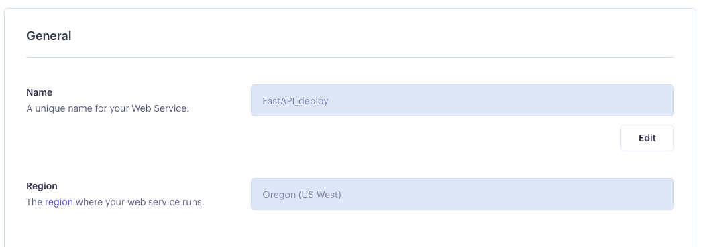
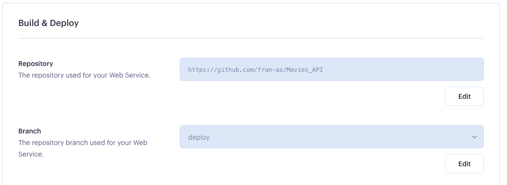
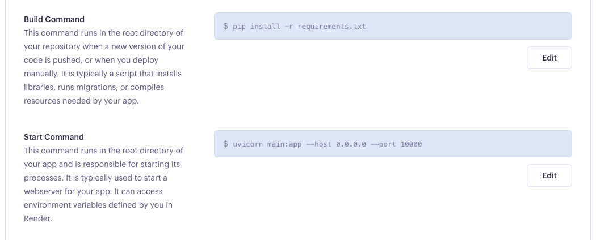
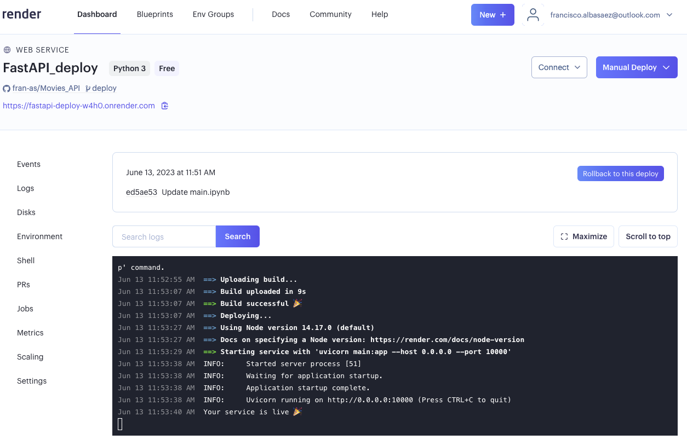

# <h1 align=center> **PROYECTO INDIVIDUAL Nº1** </h1>
# <h1 align=center> **Francisco Alba - Fran-AS** </h1>

# <h1 align=center>**`Machine Learning Operations (MLOps)`**</h1>
# Proyecto de transformación de datos,análisis exploratorio, sistema de recomendación, creacion de API con FastAPI y disponibilización web con Render

Este proyecto tiene como objetivo principal la normalización y transforamción de los archivos de datos `movies_data.csv` y `credits.csv`, para seguido de la creación de una API utilizando FastAPI y el despliegue del proyecto en Render.

## Toda la documentación pueda accederce atraves del siguiente repositorio
- [Frans-AS Repo](https://github.com/fran-as/Movies_API/tree/deploy)
## Este readme se complenta con el notebook en la raiz del repositorio
- [Notebook main.ipynb](https://github.com/fran-as/Movies_API/blob/deploy/main.ipynb)
## 1. Transformación de Datos

1. Se inició con los archivos `movies_dataset.csv` y `credits.csv` que contenían información sobre películas y créditos asociados.
2. Se realizó una exploración inicial de los datos para comprender su estructura y contenido.
3. Se identificaron los problemas de calidad de los datos, como valores faltantes, duplicados o inconsistencias.
4. Se procedió a realizar la normalización de los datos para facilitar su procesamiento y análisis a través de archivo main.ipynb:
    ### En el caso del archivo `movies_data.csv`, se realizaron las transformaciones con la clase DataGuru y se exportó a df_movies_norm.csv:
- [Archivo df_movies_norm](https://github.com/fran-as/Movies_API/blob/ed016e275c15bd006cb4c4876bf040249804b195/Data%20Set/df_movies_norm.csv)
    ### En el caso del archivo `credits.csv`, se realizaron las transformaciones con la clase DataGuru2 y se exportó a df_credits_norm.csv:
- [Archivo df_movies_norm](https://github.com/fran-as/Movies_API/blob/ed016e275c15bd006cb4c4876bf040249804b195/Data%20Set/df_credits_norm.csv)

## 2. Análisis exploratorio de los datos y sistema de recomendación

El análisis exploratorio de datos realizado consistió en el procesamiento y exploración de los conjuntos de datos "movies_data.csv" y "credits.csv" para obtener información relevante sobre las películas.

### Respecto a la consulta para recomendar peliculas, se desarollo de la siguiente manera:

1. El título de la película de entrada se convirtió a minúsculas para evitar problemas de coincidencia de mayúsculas y minúsculas.

2. Se creó una nueva columna en el DataFrame df_movies_norm que contiene los títulos en minúsculas.

3. El DataFrame se filtró para obtener la película de entrada específica.

4. Se verificó si se encontró la película de entrada en el conjunto de datos.

5. Se procedió a obtener los géneros de la película de entrada.

6. El DataFrame se filtró nuevamente para encontrar películas que tuvieran al menos uno de los géneros de la película de entrada. La película de entrada se excluyó del conjunto filtrado.

7. Las películas resultantes se ordenaron en base a su puntuación y popularidad, de forma descendente.

8. Se seleccionaron las 5 primeras películas como recomendaciones.

9. Se creó una lista de diccionarios que almacenaban la información relevante de cada película recomendada, como el título, la fecha de lanzamiento, la puntuación y la popularidad.

10. Se devolvió un diccionario que contenía el título de la película de entrada y la lista de películas recomendadas.

11. En caso de no encontrarse ninguna película con el título de entrada, se devolvió un mensaje indicando que no se encontró ninguna coincidencia en el conjunto de datos.

En resumen, este método proporciona una funcionalidad para recomendar películas similares basándose en los géneros de una película de entrada específica.

## 3. Desarrollo de la API con FastAPI
1. Se utilizó el framework FastAPI para desarrollar una API que permitiera acceder a los datos normalizados.
2. Se crearon las rutas y controladores correspondientes para manejar las solicitudes de los usuarios.
3. Se implementaron las operaciones básicas de consulta y búsqueda de películas, así como también la obtención de información detallada de una película específica.
4. Se realizaron pruebas locales para asegurarse de que la API funcionara correctamente.

## 4. Despliegue del Proyecto en Render

1. Se configuró el entorno de despliegue utilizando Render, un servicio de alojamiento y despliegue de aplicaciones web, Parametros utilizados:

2. Se creó un archivo de configuración `requirements.txt` con las dependencias necesarias para el proyecto.
4. Se realizó el despliegue del proyecto en Render, asegurando que la API estuviera disponible en línea.

## 5. Uso de la API
### Una vez desplegado, se pueden realizar las siguientes solicitudes a la API:
- [1. Consultar la cantidad de filmaciones en un mes específico](https://fastapi-deploy-w4h0.onrender.com/filmaciones/mes/)
- [2. Consultar la cantidad de filmaciones en un día específico](https://fastapi-deploy-w4h0.onrender.com/filmaciones/dia/)
- [3. Consultar el score de una película por título](https://fastapi-deploy-w4h0.onrender.com/peliculas/score/)
- [4. Consultar la cantidad de votos de una película por título](https://fastapi-deploy-w4h0.onrender.com//peliculas/votos/)
- [5. Consultar información sobre un actor específico](https://fastapi-deploy-w4h0.onrender.com/actores/)
- [6. Consultar información sobre un director específico](https://fastapi-deploy-w4h0.onrender.com/directores/)
- [7. Recomendar películas similares a una película de entrada](https://fastapi-deploy-w4h0.onrender.com/recomendar/)

## Video con demostracion del deploy
- [Deploy de API: FastAPI + Render](https://youtu.be/UXflgTJhOsk)
## Recursos Adicionales

- [Documentación de la API](https://fastapi-deploy-w4h0.onrender.com/docs)
- [Render - Plataforma de despliegue](https://render.com/)
- [Entorno virtual y despliegue local de fastAPI](https://youtu.be/J0y2tjBz2Ao)
- [Despliegue web de fastAPI con Render](https://youtu.be/920XxI2-MJ0)

